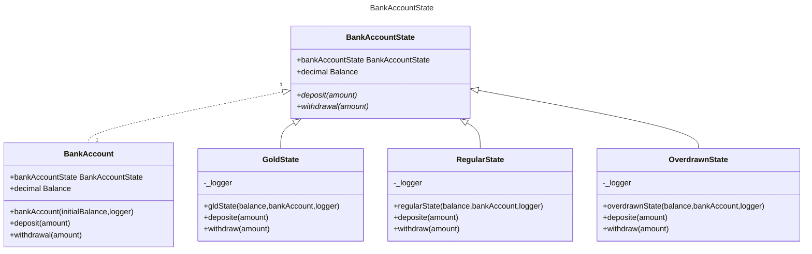

```mermaid

---
title: BankAccountState
---
classDiagram
    class BankAccount{
     +bankAccountState BankAccountState
     +decimal Balance
     +bankAccount(initialBalance,logger)
     +deposit(amount)
     +withdrawal(amount)
    }
    class BankAccountState{
    +bankAccountState BankAccountState
    +decimal Balance
    +deposit(amount)*
    +withdrawal(amount)*
    }
    class GoldState{
        -_logger
        +gldState(balance,bankAccount,logger)
        +deposite(amount)
        +withdraw(amount)
    }
    class RegularState{
        -_logger
        +regularState(balance,bankAccount,logger)
        +deposite(amount)
        +withdraw(amount)
    }
    class OverdrawnState{
        -_logger
        +overdrawnState(balance,bankAccount,logger)
        +deposite(amount)
        +withdraw(amount)
    }

BankAccountState "1" <|.. "1" BankAccount
BankAccountState<|--GoldState
BankAccountState<|--RegularState
BankAccountState<|--OverdrawnState
```

https://mermaid.js.org/syntax/classDiagram.html